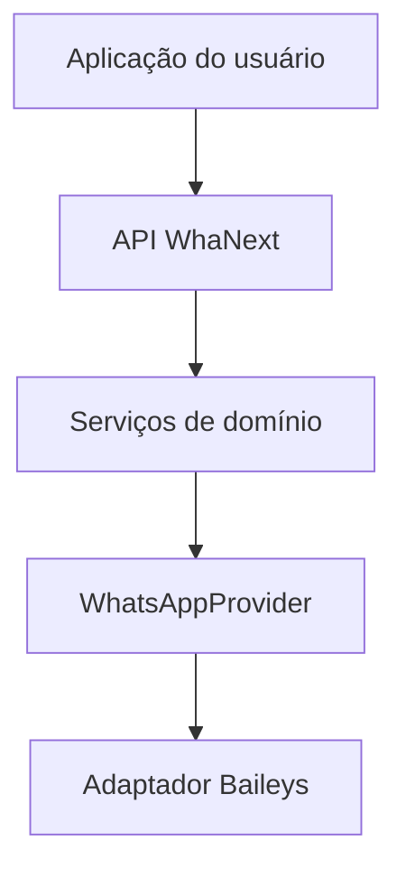

# WhaNext — Especificação v0.1

## 1. Visão

WhaNext é um SDK TypeScript de alto nível para aplicações de WhatsApp. O projeto oferece uma API de domínio estável e esconde integralmente eventos, tipos, chaves e operações específicas do provider.

O provider inicial é o Baileys. Essa escolha é um detalhe interno e substituível, não parte do contrato público do SDK.

## 2. Objetivos

- Permitir login e reconexão sem lógica de socket no código do usuário.
- Normalizar mensagens recebidas em um único modelo tipado.
- Organizar operações por domínios previsíveis.
- Evitar chamadas redundantes por meio de cache e operações idempotentes.
- Oferecer comandos declarativos com autorização e argumentos convertidos.
- Centralizar erros com códigos estáveis e contexto seguro.
- Impedir qualquer vazamento de tipos do Baileys na API pública.
- Permitir a troca futura do provider sem quebrar bots existentes.

## 3. Não objetivos da v0.1

- Cobrir todos os recursos existentes no WhatsApp.
- Garantir compatibilidade com protocolos privados futuros.
- Fornecer armazenamento distribuído pronto para produção.
- Publicar uma camada de acesso aos objetos crus do Baileys.
- Apresentar o projeto como SDK oficial do WhatsApp.

## 4. Superfície pública

| Domínio | Responsabilidade | Métodos iniciais |
| --- | --- | --- |
| `app.message` | Texto, reply, edição e exclusão | `send`, `reply`, `edit`, `delete`, `text` |
| `app.media` | Imagem, vídeo e áudio | `image`, `video`, `audio` |
| `app.group` | Estado e metadados de grupos | `open`, `close`, `invite`, `revokeInvite`, `pin`, `unpin`, `metadata`, `isAdmin` |
| `app.member` | Administração de participantes | `remove`, `promote`, `demote` |
| `app.chat` | Indicadores nativos | `typing`, `recording`, `stop`, `stopTyping` |
| `app.router()` | Registro e despacho de comandos | `command`, `dispatch` |
| `app.on` | Eventos normalizados | `message`, `connection`, `error` |

Abreviações como `msg` não são usadas. Nomes completos melhoram busca, autocomplete e consistência.

## 5. Criação e login

```ts
const app = await create({
  phone: process.env.PHONE,
  prefix: '!',
  browser: Browser.Windows,
  auth: './session',
  reconnect: {
    enabled: true,
    maxAttempts: 10,
    initialDelayMs: 1_000,
    maxDelayMs: 30_000,
  },
});

await app.login({ onCode });
```

O prefixo pertence à configuração do app e é definido uma única vez. O usuário não implementa detecção, remoção ou separação manual do prefixo.

### 5.1 Estados de conexão

```ts
type ConnectionState =
  | 'idle'
  | 'connecting'
  | 'connected'
  | 'reconnecting'
  | 'closed';
```

### 5.2 Reconexão

- Usa backoff exponencial limitado e jitter.
- Não cria um segundo socket enquanto existe um socket ativo.
- Não reconecta depois de logout, sessão inválida ou substituição da conexão.
- Zera a contagem após uma conexão bem-sucedida.
- Emite estado e número da tentativa sem expor erros do provider.

### 5.3 Pairing code

- A criação do socket e a abertura do transporte são etapas distintas.
- O provider aguarda o evento contendo o desafio `qr` antes de solicitar o código.
- O desafio confirma que o servidor está pronto para o fluxo de autenticação.
- Um socket substituído durante essa espera produz um erro recuperável.
- O status interno do provider é convertido em contexto de `WhaNextError`.
- Atualizações parciais de credenciais não marcam a sessão como registrada.

### 5.4 Sessão e store

- A sessão é persistida na pasta escolhida pelo usuário.
- Escritas de credenciais são serializadas.
- Um store limitado mantém mensagens recentes necessárias para retry.
- A implementação do store não aparece no contrato público.

## 6. Mensagem normalizada

```ts
interface Message {
  id: string;
  jid: string;
  lid?: string;
  chatId: string;
  senderId: string;
  senderIds: string[];
  senderJid?: string;
  senderLid?: string;
  keys: MessageKey;
  text?: string;
  caption?: string;
  mentions: string[];
  timestamp: Date;
  isGroup: boolean;
  isReply: boolean;
  isViewOnce: boolean;
  hasMedia: boolean;
  media?: MessageMedia;
  quoted?: QuotedMessage;
}
```

O normalizador remove envelopes internos, identifica conteúdos de visualização única, extrai menções e transforma mensagens citadas em um modelo reduzido.

`senderIds` preserva as identidades alternativas entregues pelo WhatsApp. A autorização normaliza `c.us`, JID, LID e sufixos de dispositivo antes de comparar o remetente com os participantes do grupo.

O objeto cru recebido do provider nunca é armazenado na mensagem pública.

`app.message.delete()` aceita `Message`, `SentMessage` ou `MessageKey` e converte a exclusão para a operação interna do provider.

## 7. Conteúdo enviado

`MessageContent` é uma união discriminável de texto, imagem, vídeo e áudio. Fontes de mídia aceitas:

```ts
type MediaSource =
  | Uint8Array
  | { url: string }
  | { path: string };
```

Imagem e vídeo aceitam legenda, menções e visualização única. Áudio aceita MIME e modo de mensagem de voz.

## 8. Resultados idempotentes

Operações sensíveis ao estado retornam uma união discriminada:

```ts
type ChangeResult<State extends string> =
  | { ok: true; changed: true; state: State }
  | { ok: true; changed: false; state: State };
```

Estados iniciais:

| Operação | Alterado | Sem alteração |
| --- | --- | --- |
| Abrir grupo | `open` | `already_open` |
| Fechar grupo | `closed` | `already_closed` |
| Remover membro | `removed` | `already_removed` |
| Promover membro | `promoted` | `already_admin` |
| Rebaixar membro | `demoted` | `not_admin` |

O estado, e não um texto fixo, é o contrato principal. Isso permite localização, personalização e automações sem analisar strings.

Grupos informam `addressingMode: 'lid' | 'pn'`. Remoção, promoção e rebaixamento resolvem o participante por todas as identidades conhecidas e enviam ao WhatsApp o identificador correspondente ao modo do grupo. Respostas diferentes de `200` geram `PROVIDER_ERROR` e nunca são apresentadas como sucesso.

## 9. Cache

O cache padrão é global dentro de uma instância do `app` e isolado de outras contas no mesmo processo.

```ts
interface CacheStore {
  get<T>(key: string): Promise<T | undefined>;
  set<T>(key: string, value: T, ttlMs?: number): Promise<void>;
  delete(key: string): Promise<void>;
  clear(): Promise<void>;
}
```

### 9.1 Regras

- Metadados de grupos possuem TTL configurável.
- Eventos de alteração do grupo invalidam a entrada correspondente.
- Alterações feitas pelos serviços invalidam o cache depois do sucesso.
- Stores externos podem implementar Redis, banco de dados ou cache distribuído.
- Chaves internas possuem namespace e não são parte da API pública.

## 10. Comandos

```ts
app.router().command(
  defineCommand({
    name: 'fechar',
    description: 'Fecha o grupo.',
    onlyGroup: true,
    onlyAdmin: true,
    async execute(message, args) {},
  }),
);
```

### 10.1 Restrições

- `onlyGroup`
- `onlyPrivate`
- `onlyAdmin`
- `botMustBeAdmin`

`botMustBeAdmin` compara todos os identificadores conhecidos da conta conectada com `id` e `lid` dos participantes em cache. Quando a conta não possui o cargo necessário, o comando falha com `BOT_NOT_ADMIN` antes de executar sua lógica.

### 10.2 Prefixo

```ts
const app = await create({ prefix: '!' });
```

- O padrão é `!`.
- Prefixos com mais de um caractere são aceitos.
- Prefixos vazios ou contendo espaços são rejeitados na criação do app.
- Apenas mensagens iniciadas pelo prefixo configurado são despachadas.
- O prefixo é removido antes da criação do `ArgsParser`.

### 10.3 ArgsParser

Cada chamada consome a próxima posição:

```ts
args.string('nome');
args.number('quantidade');
args.boolean('ativo');
args.enum(['admin', 'member'] as const, 'cargo');
args.user('membro');
args.duration('tempo');
args.rest();
```

Argumentos ausentes ou inválidos geram `WhaNextError` antes da lógica do comando prosseguir.

## 11. Erros

```ts
class WhaNextError extends Error {
  code: WhaNextErrorCode;
  context: Readonly<Record<string, unknown>>;
  recoverable: boolean;
}
```

Os códigos são estáveis, documentáveis e independentes do provider. O campo `cause` pode manter a causa interna para diagnóstico, mas consumidores não precisam conhecer sua estrutura.

## 12. Fronteira do provider

Todos os serviços dependem exclusivamente de `WhatsAppProvider`:



Regras da fronteira:

- O adaptador pode importar tipos do Baileys.
- Nenhum arquivo exportado pelo pacote pode mencionar tipos do Baileys.
- Eventos do provider são normalizados antes de alcançar `WhaNextApp`.
- Erros do provider são convertidos antes de alcançar consumidores.
- Providers falsos são usados em testes unitários.

## 13. Estrutura

```text
src
├── app
├── auth
├── cache
├── commands
├── errors
├── models
├── provider
│   └── baileys
└── services
```

Imports internos usam o alias `@/`.

## 14. Critérios de aceite da fundação v0.1

- Typecheck estrito concluído sem erros.
- Build ESM com declarações TypeScript.
- Testes unitários sem conexão real com o WhatsApp.
- Login entrega código de pareamento e aguarda conexão.
- Reconexão não ocorre em falhas terminais.
- Cache impede consultas repetidas de metadados.
- Estado repetido não produz mutação redundante.
- Router entrega `ArgsParser`, nunca `string[]`.
- Prefixo é configurado uma vez no `create()` e aplicado globalmente pelo router.
- `dist/index.d.ts` não expõe identificadores do Baileys.

## 15. Próximas iterações

1. Catálogo de feedback localizado com modo automático de reply.
2. Download e streaming normalizado de mídias.
3. Reações, enquetes, contatos, documentos e stickers.
4. Eventos de edição, remoção, reações e participantes.
5. Store Redis oficial e locks para execução distribuída.
6. Métricas, tracing e logger injetável.
7. Testes de contrato do provider e ambiente de integração controlado.
8. Política formal de compatibilidade e depreciação da API.
